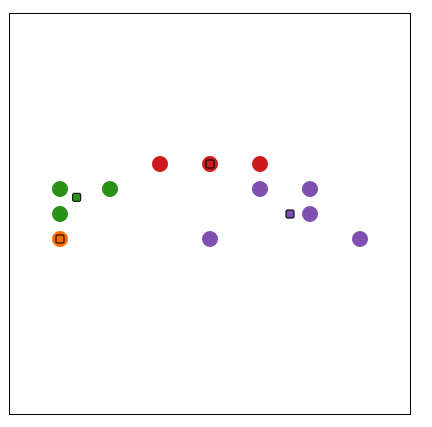

# k-means algorithm example

``d3.js`` is used for displaying result

To calculate centroids, was used formula - [``finite set of points``](https://en.wikipedia.org/wiki/Centroid)

To calculate distance, was used formula - [``Euclidean distance``](https://en.wikipedia.org/wiki/Euclidean_distance)

### Result

